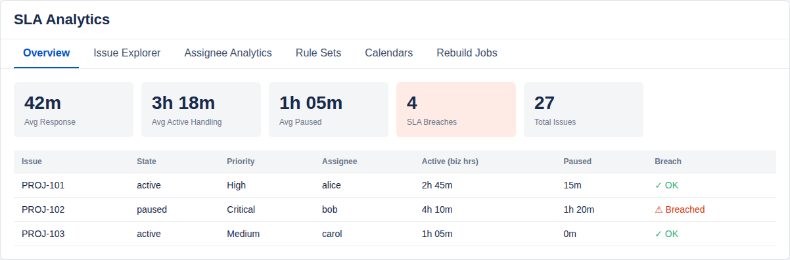
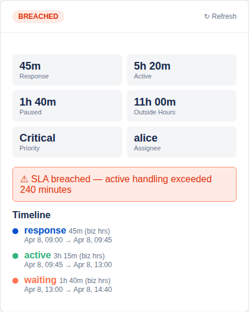
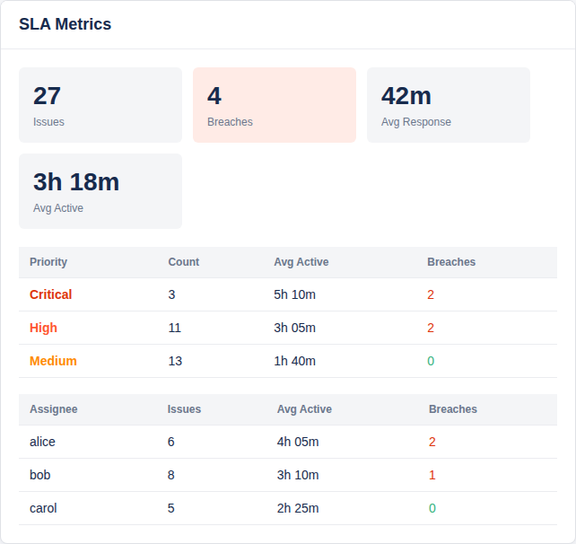

# Jira-SLA

Forge-native Jira SLA tracking app that reconstructs Jira issue history into
deterministic SLA segments and exposes the precomputed results through project,
issue, dashboard, admin, automation, and Rovo-ready surfaces.

## What changed in Milestones 1 and 2

- configurable Jira field mappings for ownership, team, responsible organization,
  and other SLA-relevant fields
- ownership-field-driven SLA start support with tracked ownership values and
  precedence between ownership field, team field, and assignee fallback
- explicit `waiting` vs `paused` handling, plus configurable resume rules for
  statuses such as `Need More Info`
- admin diagnostics that validate mapped Jira fields before recompute
- customer-facing read-only approval and business-logic documents

## Installation

See the installation and approval guides:

- [docs/installation-guide.md](docs/installation-guide.md)
- [docs/customer-installation-guide.md](docs/customer-installation-guide.md)
- [docs/sla-business-logic.md](docs/sla-business-logic.md)
- [docs/customer-approval/read-only-approach.md](docs/customer-approval/read-only-approach.md)
- [docs/customer-approval/business-logic-account-template.md](docs/customer-approval/business-logic-account-template.md)
- [docs/customer-approval/sample-calculation-walkthrough.md](docs/customer-approval/sample-calculation-walkthrough.md)
- [docs/customer-approval/high-level-calculation-flow.md](docs/customer-approval/high-level-calculation-flow.md)

## Read-only access posture

The app is positioned as read-only extraction/reporting for Jira issue history.

- Jira scopes: `read:jira-work`, `read:jira-user`, `storage:app`
- The app reads issues, changelogs, worklogs, projects, statuses, assignable
  users, and field metadata
- The app does **not** write Jira fields, comments, worklogs, transitions, or
  statuses
- Derived summaries, segments, rebuild jobs, calendars, rule sets, and field
  mappings are stored in Forge storage only

## App surfaces

- **Jira project page** – KPI cards, issue explorer, assignee analytics, rule
  set administration, field mappings, calendars, and rebuild activity
- **Jira issue panel** – per-ticket SLA state, response/active/paused/waiting
  metrics, breach status, and segment timeline explanation
- **Jira dashboard gadget** – rollup metrics by priority and assignee
- **Scheduled trigger + automation action** – recompute summaries from Jira
  changelog updates
- **Rovo agent + actions** – query precomputed SLA summaries conversationally

## Local validation

From the repository root:

```bash
npm install
npm test
npm run build
```

The repository uses seeded Jira-like fixtures so the app can be built and
validated locally without a live Jira tenant. Replace the in-memory store with
Forge storage bindings when wiring the app into a deployed Forge environment.

## Runtime configuration

- Deployed Forge environments default to a Jira-backed store that fetches live
  issues, assignable users, project statuses, and Jira field metadata
- Field mappings can now be managed from the admin UI and attached to rule sets
- `TEAM_FIELD_KEY` remains available as a fallback for tenants that want to
  force a specific team field key
- Set `USE_SEED_DATA=true` when you explicitly want the seeded in-memory store
  instead of live Jira data, such as local development or troubleshooting

## UI screenshots

### Project page – SLA Analytics



### Issue panel – per-ticket SLA breakdown



### Dashboard gadget – SLA rollups


